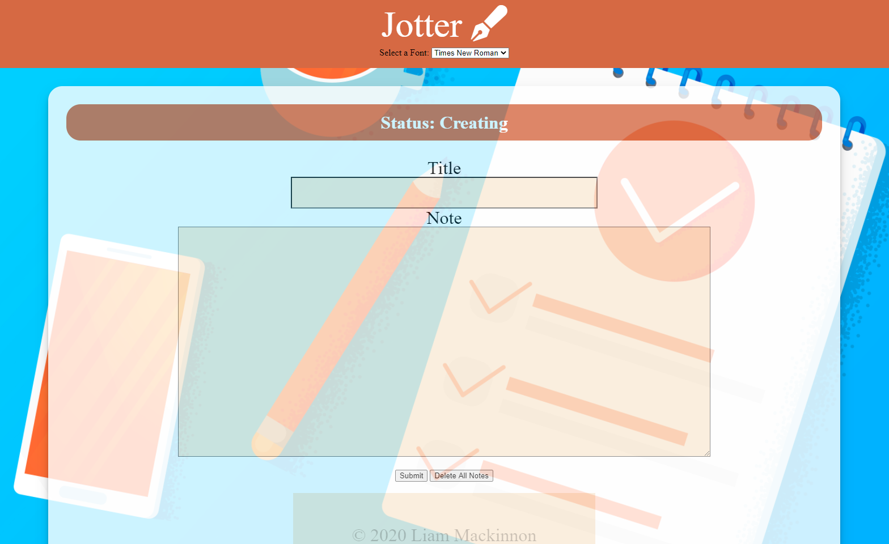

# Jotter

## Table of Contents
> - [Description](#Description)
> - [Keywords](#Keywords)
> - [Contributors](#Contributors)
> - [Usage](#Usage)
> - [Installation](#Installation)
> - [Test](#Testing)
> - [License](#License)
> - [Deployment](#Deployment)
> - [Questions](#Questions)

## Description
>MongoDB Note-Taker Application

## Keywords
>*MongoDB, noSQL, Note-Taker*

## Contributors
>Liam Mackinnon

## Usage 
>Currently limited to local usage (will expand after mongoose initialization)
> - npm install
> - node server.js

## Installation
>*npm install*

## Testing
>None

## License
>Unlicense

## Deployment
Live Recording?: No  

Screenshot?: Yes

### Questions
>If you have any further questions about the application:
>Email: LMackinnon.inbox@gmail.com
>
>GitHub: www.github.com/liam-mack
